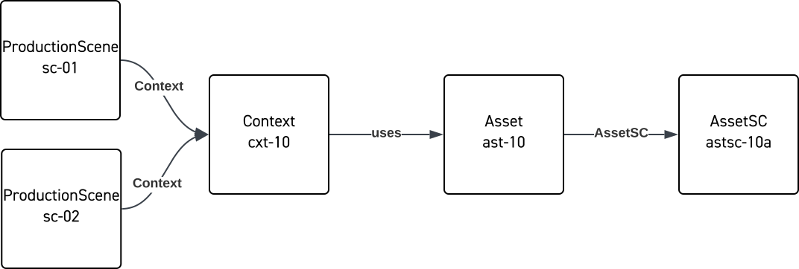
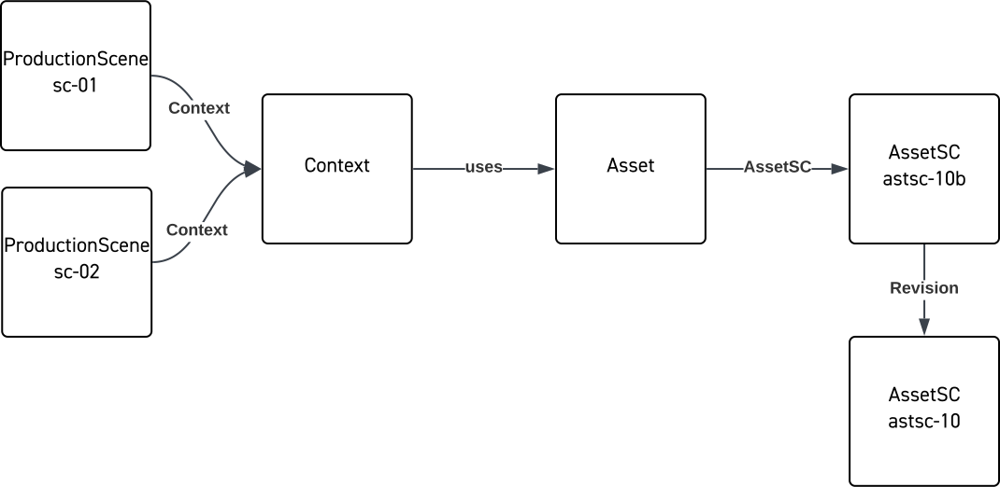
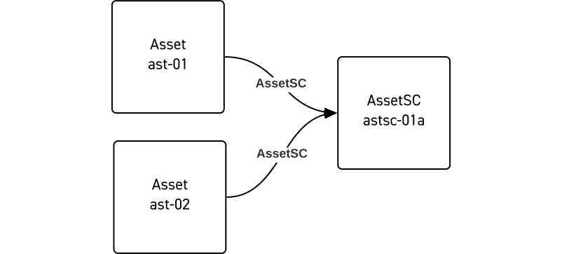
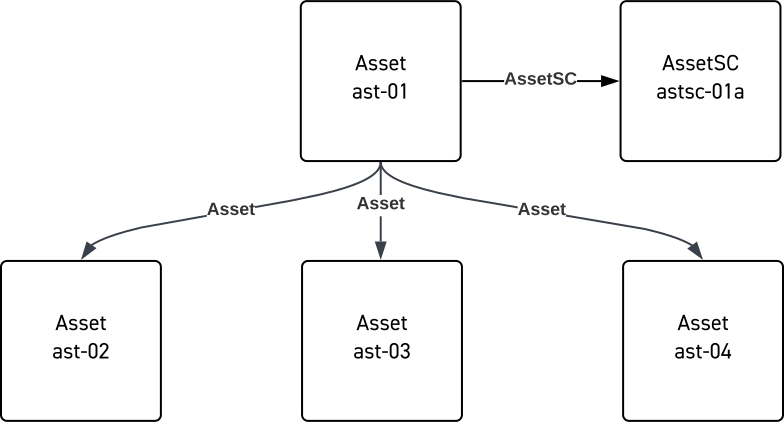

# Assets

# Assets

Tracking and categorizing the assets that make up a production is probably one of the most complex parts of production management and complex systems have been developed to do this over the years. The role of OMC-JSON is not to replace such management, but to provide a common expression for communicating information about these assets between applications and workflows. This can include how assets relate to one another as well as how they relate to the script and parts of the production process.

The 2030 vision establishes some core ideas behind the handling of assets:

- Separate an asset’s metadata (information about the asset) from the essence of the asset (the actual thing, e.g., a digital file like a jpeg or a physical item like a prop). A key advantage of this separation is that information about the asset can be made available without actually needing to include the entire object. This can improve security and save resources if an asset does not need to be retrieved and interrogated for embedded data.
- Separate an asset’s [structural and functional characteristics](./FunctionalStructural.md). That is, separate what an asset is (structural) from what it is used for (functional).
- All assets are uniquely identified. This allows the specific location of an asset to be abstracted and accessed only when needed. This typically involves the use of a resolution service that returns a specific location given an identifier on request. [Read our blog post on resolving assets](https://movielabs.com/through-the-looking-glass/).

In OMC, an Asset is generally composed of the following main parts:

- An identifier that is unique to the particular object. This identifier can remain the same even if the underlying essence undergoes updates as it iterates through versions.
- Structural Characteristics (AssetSC), which in itself is uniquely identified, describes the essence that is currently associated with the Asset. The AssetSC can change over time, for example, if a new version of something is created.
- Functional Characteristics (AssetFC) that describe what the Asset is used for in the production. In RDF OMC, this is a separate entity, but in OMC-JSON this is held as a property of the Asset to simplify things. For Assets that share structural characteristics but have multiple functional uses we recommend creating two separate Assets, each with a unique identifier, but sharing structural characteristics (essence).

Often the process of deciding exactly which set of Assets a workflow needs is complicated. To help with this scenario, Assets can be related to other parts of the production, generally through the use of a [Context](./RelationshipContext.md).

Assets also often advance through multiple versions, with different variants or representations of the same asset. Click here to learn more about [Versions](./Version.md).

## Conventions

**Identifiers**
Like all entities in OMC, identifiers are used to identify an Asset. The Asset itself comprises a set of properties that describe it, including its structural and functional characteristics, prior versions, provenance, etc.

The Asset will usually include a property (AssetSC) that refers to an entity describing its structural characteristics and for digital assets this is generally the essence. These are identified separately because an Asset’s structural characteristics may change over time.

For more information, see here: [Identifiers](https://mc.movielabs.com/docs/ontology/utilities/utilities/)

How to construct an asset and use the different identifiers:

- The identifier for the entity uniquely identifies the 'whole' asset - the combination of its structural and functional characteristics.
- The identifier in the structural characteristics identifies the essence of the Asset. In many cases, the essence (e.g., a file or a URL-accessible resource) can be located or resolved using the AssetSC identifier.

The following diagrams illustrate the idea:

- Two Production Scenes utilize the same Asset (e.g., a 3D model of a prop).

The Director requests some changes to the design of the prop resulting in a revision.

- The Production Scenes still refer to the same Asset, it is after all the same ‘thing’ or same prop. You do not want to have to find and update every place in the system that refers to this Asset and change its identifier
- By updating the reference that the Asset uses to refer to a new AssetSC representing the revised essence, you only need to make a change in one place, and the next time the Asset is called for, it will refer to the correct revision.
- You can also create a record of revisions by further having the new AssetSC refer to the previous version. More details in the section on **[[Versions]].**
  

*Note: A useful side effect of having separate identifiers for the 'whole' asset and the essence is that this more* *clearly delineates* *metadata and object, allowing security authorization to be more easily separated. This allows applications and participants to view metadata about assets without being granted access to the asset itself. For example, a system admin can provision, move or migrate files without being granted direct access to sensitive content itself.*

As part of the 2030 vision we advocate for the use of a resolution system, where identifiers are used to resolve a location of a resource, we include examples of how the JSON can map to resolver entries, for more details on how resolvers work and implementation, see here: [Through the Looking Glass](https://movielabs.com/through-the-looking-glass/). If you are not using a resolver, this can be ignored. The resolver examples do not cover all possible ways of using the resolver with Assets.

**Structural and functional properties**
An Asset can carry additional data that help describe its functional and structural characteristics. Structural properties might include things like a filename, dimensions, mime type, etc.

It can be especially useful where metadata is originally embedded as part of the essence file. OMC can allow properties to be accessed by applications and workflows without having to load the essence file.

*Note:* *Given the large* *number* *of structural types and potential properties involved**,* *it should be remembered* *that* *the intent of the OMC-JSON is not to replicate existing metadata schemes. The structural properties provide an opportunity to communicate some key aspects of data that* *are* *useful* *for* *finding, identifying, or disambiguating assets in a workflow.*

It is also worth noting that data itself can be essence. For example, camera metadata is often saved as a separate file, known as a sidecar, along with the captured media. This file would itself be an Asset. Some subset of the data can be directly included as properties in the OMC-JSON, but as the note above points out, judiciously.

## Examples

The following JSON examples show only the pertinent attributes for clarity. Real entities would also include properties like `schemaVersion`, `structuralProperties` and `functionalProperties`.

**Single Digital Asset**
This shows the simplest case of single Asset (A1) and single AssetSC (E1).

Asset

    {
        "entityType": "Asset",
        "identifier": [
            {
                "identifierScope": "labkoat",
                "identifierValue": "ast-01"
            }
        ],
        "name": "Blaster dodge",
        "AssetSC": {
            "identifier": [
                {
                    "identifierScope": "labkoat",
                    "identifierValue": "astsc-01a"
                }
            ]
        },
        "assetFC": {
            "functionalType": "technicalReference"
        }
    }

AssetSC

    {
        "entityType": "AssetSC",
        "identifier": [
            {
                "identifierScope": "labkoat",
                "identifierValue": "astsc-01a"
            }
        ],
        "structuralType": "digital.image"
    }

----------

**Digital Asset, two functional uses**
This shows two Assets which use the same essence; one uses the image as reference art and the other uses it as a texture.

There does not have to be any formal relationship between Assets A1 and A2, though, of course one can be added.

Asset

    {
        "Asset": {
            "entityType": "Asset",
            "identifier": [
                {
                    "identifierScope": "labkoat",
                    "identifierValue": "ast-01"
                }
            ],
            "AssetSC": {
                "identifier": [
                    {
                        "identifierScope": "labkoat",
                        "identifierValue": "astsc-01a"
                    }
                ]
            },
            "assetFC": {
                "functionalType": "technicalReference"
            }
        }
    }

Asset

    {
        "Asset": {
            "entityType": "Asset",
            "identifier": [
                {
                    "identifierScope": "labkoat",
                    "identifierValue": "ast-02"
                }
            ],
            "AssetSC": {
                "identifier": [
                    {
                        "identifierScope": "labkoat",
                        "identifierValue": "astsc-01a"
                    }
                ]
            },
            "assetFC": {
                "functionalType": "texture"
            }
        }
    }

AssetSC

    {
        "AssetSC": {
            "entityType": "AssetSC",
            "identifier": [
                {
                    "identifierScope": "labkoat",
                    "identifierValue": "astsc-01a"
                }
            ],
            "structuralType": "digital.image"
        }
    }

----------
## Asset Groups

Asset groups provide for logical groupings of Assets into a single entity. Asset groups are Assets themselves. They refer to other Assets or Asset groups by their identifiers. This creates a hierarchical structure of Assets.

Asset groups are deliberately simple. They can be used to communicate sets of Assets needed for a workflow or application, or to group things together for administrative convenience (i.e. a set of images that make up a storyboard). How an Asset Group is used in an application can be complex and application-dependent. Mechanisms like USD, EDL, and AAF carry detailed information about how multiple assets are used together in specific applications. OMC-JSON acts more as a manifest, and the expectation is that the files describing how an application deploys these files is included as part of this manifest.

Asset groups can be useful as a simple organizing construct: e.g., group the concept art for a particular character together or collect a series of storyboard frames into an ordered group.

Using groups can simplify managing the relationships that exist between Assets and other elements of the production. By placing multiple images in a group, only a single relationship need be kept to the top level of the group. For example, a Character is related to an Asset Group containing concept art.

----------

**Asset** **Group**
This Asset is an Asset Group that contains three other Assets.

- OMC has relationships `member` and `memberOf` allowing bi-directional navigation. OMC-JSON represents only a hierarchy for simplification; if a consuming application needs both directions, it is easy to infer.
- Asset Groups can contain Asset Groups, because any Asset can be a Group; so hierarchies of any depth can be created.
- This example below shows AssetSC expanded to include its properties.

Asset

    {
        "entityType": "Asset",
        "identifier": [
            {
                "identifierScope": "labkoat",
                "identifierValue": "ast-01"
            }
        ],
        "name": "Title",
        "AssetSC": {
            "entityType": "AssetSC",
            "identifier": [
                {
                    "identifierScope": "labkoat",
                    "identifierValue": "astsc-01a"
                }
            ],
            "structuralType": "assetGroup"
        },
        "assetFC": {
            "functionalType": "artwork.storyboard"
        },
        "Asset": [
            {
                "identifier": [
                    {
                        "identifierScope": "labkoat",
                        "identifierValue": "ast-02"
                    }
                ]
            },
            {
                "identifier": [
                    {
                        "identifierScope": "labkoat",
                        "identifierValue": "ast-03"
                    }
                ]
            },
            {
                "identifier": [
                    {
                        "identifierScope": "labkoat",
                        "identifierValue": "ast-04"
                    }
                ]
            }
        ]
    }

