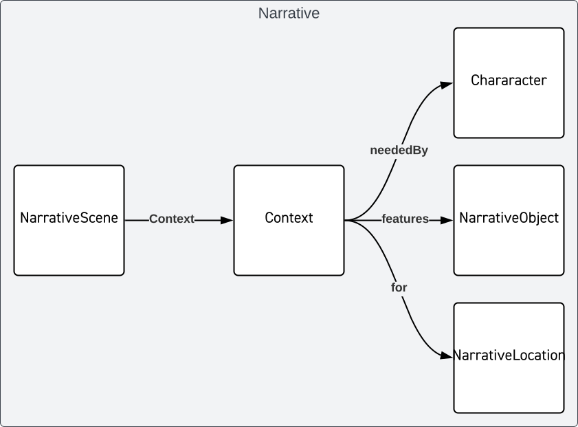
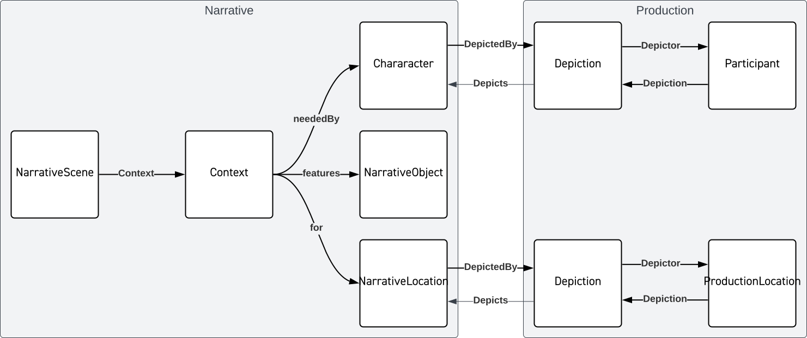
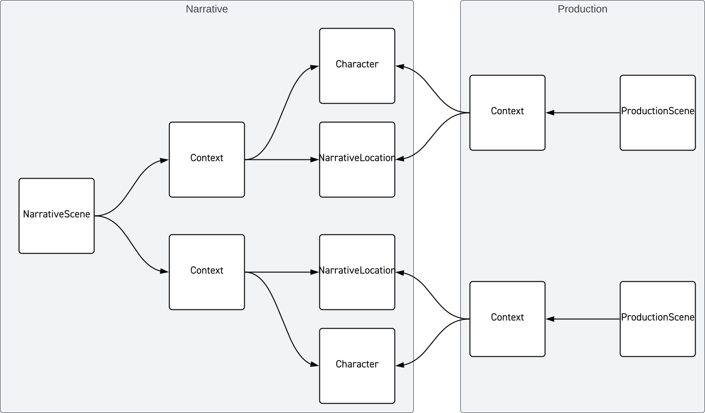

# Narrative & Production
OMC makes a distinction between Narrative elements and Production elements.

Narrative elements generally pertain to the script and include things like characters, locations and props. These are often first realized during the script breakdown. Production elements are the things used in production and post-production to create the work: the actors and other people, physical props and sets and the sound stages used to film and create.

A full explanation can be found in [OMC Part 2 - Context](https://mc.movielabs.com/docs/ontology/context/narrative-and-production-objects/)

Maintaining and understanding the connections between production elements and narrative is one of the areas of production that is often overlooked but has the potential to provide much greater understanding and control over changes to the script that can have multiple ripple effects throughout production.

During pre-production and script breakdown, elements important to the narrative are identified, called out, and tagged. OMC represents this as a set of Narrative elements and relates them through [Contexts](./RelationshipContext.md).

The diagram below shows a Narrative Scene related (via a Context) to a Character, a NarrativeObject (prop), and a NarrativeLocation. During pre-production, we may not know which actor will be playing the character, no-one has built any props, and filming locations have not been chosen.

As pre-production transitions into production, many of the narrative elements start having ‘real’ things associated with them; filming locations are chosen, actors are cast, and props are made. These can then be related to their narrative elements, using mechanisms like Context and Depiction.

The following diagram shows how the Character is now related to a Participant and the NarrativeLocation to ProductionLocation.

With this clear separation and the relationships established, it becomes a much simpler task to assess and manage changes to the script and their impacts on production.

The following example shows how something that is a single narrative entity may take multiple production entities to realize it. A narrative scene takes place with two characters having a phone conversation, a single narrative construct. But the production elements contain two locations (a NY street and apartment interior), both shot at different locations, on different days with different actors, props, etc.

This is a very simplified diagram, but as you can see by continuing to relate things like the Participants, ProductionLocation, etc., it becomes clear how you can trace back all the narrative elements that were needed for a production scene, or which production elements were used in a given narrative scene.

<!--
Copyright 2021-2023 Motion Picture Laboratories, Inc.
SPDX-License-Identifier: APACHE-2.0
-->
