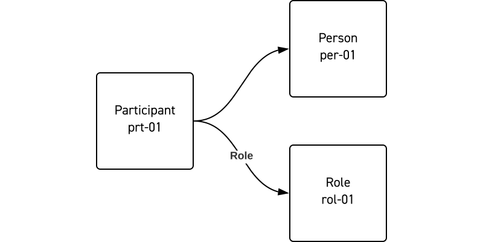

# Participants
No production happens without the people that show up and do the work, so being able to describe and manage and understand the Participants is a critical part of managing a production. In the OMC, the Participants are not just the people; it is often useful to think of groups of people, departments or organizations as well as the various services that are used to execute functions as Participants.

Like other aspects of the OMC, Participants have both a structural and functional component. The structural part is the actual person or organization, and the functional part represents the role, or what they do on the production.

Separating these parts out allows for considerable flexibility in structuring and managing participants.

Most productions know they need certain roles filled before they have hired specific people for those roles. For example, a Participant with the role of Gaffer can be set up with just its functional characteristics, but without the structural characteristics (an actual person.)

OMC-JSON: Participant
```JSON
{
  "entityType": "Participant",
  "identifier": [
    {
      "identifierScope": "labkoat",
      "identifierValue": "prt-01"
    }
  ],
  "participantFC": {
    "functionalType": "gaffer",
    "Role": [
      {
        "identifier": [
          {
            "identifierScope": "labkoat",
            "identifierValue": "rol-01"
          }
        ]
      }
    ]
  }
}
```


Later when a hiring decision is made the specific person is related to the participant. Any other relationships that were established regarding scheduling or responsibilities remain.

OMC-JSON: Participant
```JSON
{
  "entityType": "Participant",
  "identifier": [
    {
      "identifierScope": "labkoat",
      "identifierValue": "prt-01"
    }
  ],
  "ParticipantSC": {
    "identifier": [
      {
        "identifierScope": "labkoat",
        "identifierValue": "per-01"
      }
    ]
  },
  "participantFC": {
    "functionalType": "gaffer",
    "Role": [
      {
        "identifier": [
          {
            "identifierScope": "labkoat",
            "identifierValue": "rol-01"
          }
        ]
      }
    ]
  }
}
```

OMC-JSON: Role
```JSON
{
  "entityType": "Role",
  "identifier": [
    {
      "identifierScope": "labkoat",
      "identifierValue": "rol-01"
    }
  ]
  "roleType": "gaffer"
}
```


If that person is replaced at a later date, only the relationship to the person is changed. The Participant itself remains related to all of its relative context such as which production scenes they are needed on, etc.

**Roles and functional type**
Sometimes people perform multiple roles, for example, a person who both acts and directs. Despite being the same person, when separated into two Participants (each using the same person), each Participant can be given different Roles. This then allows each to be related to relevant aspects of the production independently, providing a clear separation of responsibilities. Work assignments, notifications, scheduling, etc. can be governed by the role.

- If our person is acting in a scene on a particular day, they will need hair/makeup and wardrobe and their call times would be different than if they were only directing on that day.
- There can be important considerations for security. Different roles are typically granted different levels of access to production assets.

Roles are also a common mechanism for managing security, certain roles are granted access to production assets or locations. These roles can get quite nuanced, and it may be desirable for people to have multiple roles, each granting a set of fine-grained privileges. Also, on productions of different sizes, Roles may be consolidated into one Participant or spread across multiple.

The `functionalType` is intended to be a more general description of a Participants responsibilities and we expect to enumerate some shared vocabulary for standard industry jobs. For example, someone may be a gaffer on production. On a smaller production there may be only one gaffer and they do all the Roles, on a larger production there would be multiple gaffers where the Roles are split between them, but they’re still all gaffers.

**Delegation**
It is common to hire an organization to carry out a specific role or job on a production, without the requirement that the production company specifically know the details of each individual doing the work, for example a catering company for craft services or a VFX studio hired to do an effects shot. In these scenarios, a trusted contractor may be delegated access to certain assets and the company is then left to manage individual access.

## Participant Groups
Participants, like other entities, can be arbitrarily grouped. A Participant group is a group of Participants, which in themselves could be Participant Groups, creating a hierarchical structure. A camera unit is an example of arbitrary group, where a set of people will share some set of attributes, like scheduling information.


