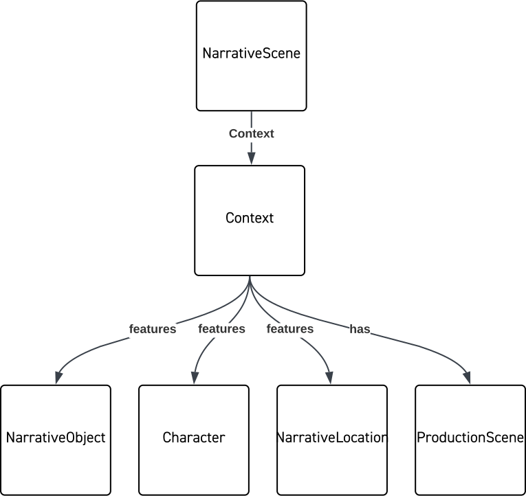

# Relationships
Relationships between entities are an essential part of the ontology. The base ontology is written in RDF, which in common with graph theory and databases natively supports the idea of relating two nodes in a graph using an edge (the relationship).

This type of mechanism is not inherently native to JSON, and although JSON-LD provides a serialization for graph data it is not widely adopted and complex to use. Therefore OMC-JSON needs a mechanism to express them. In the interests of managing schema complexity, OMC-JSON makes some compromises and defines two principle ways to encode the relationships.

In OMC-RDF it is possible to create an edge of a desired type between any two nodes, this might be for an intrinsic property, to a Context, or using some semantic description. To help manage the complexity of the JSON schema and to simplify parsing, OMC-JSON uses direct relationships only for intrinsic properties, for all other semantic relationships a Context is used. It should be noted that applications do not need to implement the idea of Context in their own internal representations, it might make sense to discard this layer of encapsulation and have the relationships held directly internally, whether that be as a key or an edge, and application could infer inverse relationships where appropriate as well.

Identifiers are the foundation of relationships; all entities must have a unique identifier within a scope and relationships are between two entities (it is technically possibly for an entity to have a relationship to itself, although currently we do not anticipate that as a use case in OMC). Relationships in OMC always have a direction (from one entity to another), typically there is an inverse relationship. The names of the relationships in OMC carry semantic meaning that indicate how entity A is related to entity B, which is generally not the same as how B is related to A.

In OMC-JSON we generally have two patterns to express relationships, they can exist as a property of an entity or they can be part of Context associated with that entity. Exactly when and how to use each mechanism is a recommended practice in OMC, but in OMC-JSON it is enforced to make schema development and validation more manageable.

## Intrinsic properties

An intrinsic property is one that is part of the essential nature of an entity, for example a Production Location has a Location (the actual address), a Character will need a Depiction, or an Asset or Participant will have structural characteristics. Without these the thing is not really a thing, however sometimes these properties are entities in their own right. This means that the value of an intrinsic property may be the identifier of another entity. 

By convention, OMC-JSON uses pascal case for intrinsic properties represented by another entity. Often in the schema the property is named for the entity it relates to, but not always. The property may relate to a single entity or multiple entities.

*Note: The schema generally enforces either an array or a single object. In the case of an array, even if there is one object, it must still be in an array. This is enforced so that parsers know what to expect and do not have to type check every property to know if it is iterable or not.

In OMC-RDF, the relationship itself is named. For example, `AssetGroup → hasMember → Asset`. In OMC-JSON, for intrinsic properties, the relationship name is omitted to simplify and reduce nesting, but can be inferred if mapping back to the fuller graph model.

The following OMC-JSON shows an example Asset.

- AssetSC: Refers to a single entity describing the structural characteristics.
- Asset: Refers to multiple entities, i.e., other Assets that are part of this Asset Group.

OMC-JSON: Asset
```JSON
{
    "Asset": {
        "entityType": "Asset",
        "identifier": [{
            "identifierScope": "Movielabs",
            "identifierValue": "ast-A"
        }],
        "AssetSC": {
            "identifier": [{
                "identifierScope": "Movielabs",
                "identifierValue": "per-5678"
            }],
        },
        "Asset": [
            {
            "identifier": [{
                "identifierScope": "Movielabs",
                "identifierValue": "ast-B"
            }]
            },
            {
            "identifier": [{
                "identifierScope": "Movielabs",
                "identifierValue": "ast-C"
            }]
            }
        ]
    }
}
```
 The producer of the payload can elect to serialize the properties of the Asset and include any or all of those properties in the payload or leave it to the consumer to request those details with another lookup.


## Context
Very little created as part of a production exists solely on its own. When things are created, they have a purpose within other parts of the production - they are used by someone or at a specific location or as part of a set or particular scene. In other words, those things have Context.

This Context can provide us details like what day we need a thing on set, which actor uses it, or what other things are needed to make use of it. In OMC, we use a Context to describe how one thing relates to another by relating the two entities with semantic meaning.

A Context is an entity and by organizing relationships into a Context several benefits become available:

- Contexts can be shared; so sets of entities that share connections only need one Context between them.
- Entities can have multiple Contexts that describe different sets of relationships, with each Context describing different uses in different workflows.
- A Context can have a Context, meaning they can be composed of other Contexts, promoting reuse.

**Relationship naming.**

The relationships can generally be thought of as having a verb and noun, separated using dot notation, `<verb>.<noun>`. This follows the typical convention of JSON pointer which is used when accessing JSON properties.

The verbs are grouped, connecting entities of similar types, and generally have a name for each direction of the relationship:

- `features` and `featuresIn` are used to relate narrative entities.
- `uses` and `usedIn` relate production entities.

The nouns are generally the entity to which they refer, for example, `Character` or `ProductionScene`.

**Context type**

The broadest form of context is a `mediaCreation` context, but OMC also defines two narrower forms, a `narrative` and `production` context. We anticipate that additional types of contexts will be useful, as being able to organize and attach the right contexts to things at the right time will be key to setting workflows.

**Composing Contexts**

It is possible to compose Contexts using multiple Contexts in two different ways: the Context property on an entity is an array, and can therefore refer to multiple Contexts; and Contexts also have a Context property, which can in turn refer to other Contexts.

**Examples**

Following are some examples of how contexts can be created and how they are used. There are additional examples in the section covering [Depictions & Portrayals](./DepictionPortrayal.md).

This example of a narrative context shows a NarrativeScene related to several other narrative entities that feature in it: Characters, some NarrativeObjects (props) and a NarrativeLocation.

OMC-JSON: NarrativeScene
```JSON
{
  "entityType": "NarrativeScene",
  "identifier": [
    {
      "identifierScope": "labkoat",
      "identifierValue": "nsc-01"
    }
  ],
  "sceneNumber": "1",
  "Context": [
    {
      "identifier": [
        {
          "identifierScope": "labkoat",
          "identifierValue": "cxt-01"
        }
      ],
      "contextType": "narrative",
      "features": {
        "Character": [
          {
            "identifier": [
              {
                "identifierScope": "labkoat",
                "identifierValue": "chr-01"
              }
            ]
          }
        ],
        "NarrativeObject": [
          {
            "identifier": [
              {
                "identifierScope": "labkoat",
                "identifierValue": "nobj-01"
              }
            ]
          }
        ],
        "NarrativeLocation": [
          {
            "identifier": [
              {
                "identifierScope": "labkoat",
                "identifierValue": "nloc-01"
              }
            ]
          }
        ]
      },
      "has": {
        "ProductionScene": [
          {
            "identifier": [
              {
                "identifierScope": "labkoat",
                "identifierValue": "ps-01"
              }
            ]
          }
        ]
      }
    }
  ]
}
```



<!--
Copyright 2021-2023 Motion Picture Laboratories, Inc.
SPDX-License-Identifier: APACHE-2.0
-->
